# Prediction & Classification of Cardiac Arrhythmia
## Wesbite Link: http://34.70.169.199/

#### This is a Deep Learning Project which helps in predicting whether a person is suffering from Cardiac Arrhythmia or Not plus telling which type of Cardiac Arrhythmia can this be.

## 	MODELING AND IMPLEMENTATION DETAILS

## Design Diagrams

## Use Case Diagram

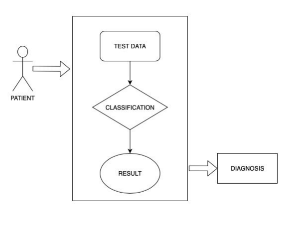

## Flow Diagram

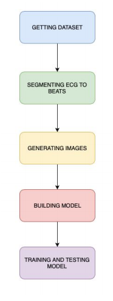

## 	Sequence Diagram

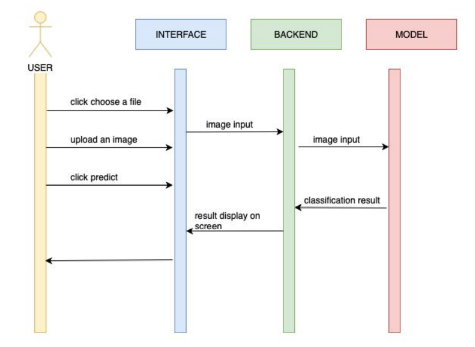

## 	Implementation Details and Issues
We have utilized the MIT-BIH arrhythmia database for the CNN model preparing and testing. The MIT-BIH Arrhythmia Database contains 48 half-hour passages of two-channel walking ECG accounts, from 47 subjects concentrated by the BIH arrhythmia research facility somewhere in the range of 1975 and 1979. For each record, there are three files namely:
1.	Annotation file
2.	Signals file
3.	Header file
The ECG chronicles were digitized at 360 examples for each second per channel with a 11-piece goal over a 10 mV extent. At least two cardiologists freely commented on each record. Any differences were set out to get the PC meaningful reference comments for each beat. There are around 110,000 comments in total included with the database.
	
ECG Wave
ECG wave, its components, and the meaning of each component of the wave are shown below.

## ECG WAVE

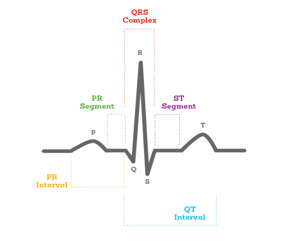

## ECG Wave Description

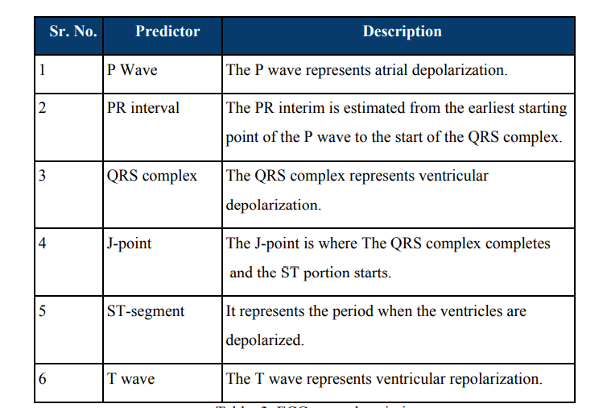

## 	Implementation Steps
### STEP 1: 
Downloaded the dataset available at MIT-BIH Arrhythmia Database. Randomly visualized a few records from the dataset to understand the structure of the dataset.
### STEP 2:
In the next step, we counted the number of beats for every annotation available in the dataset. More precisely we calculated the number of beats for all the types of arrhythmia present in the dataset. We discarded the types with very few beats. In the end, we were left with the following types.

## Type and number of images

### STEP 3:
Every record of the dataset is then processed using the Python waveform-database(WFDB) package. WFDB is a library tool used for processing waveform-database signals and annotations. Using this we segmented the beats, of the category types mentioned in above Table, from the database.

### STEP 4:
We plotted each and every beat obtained in the above step using the Matplotlib library. Then we used OpenCV to convert these plots to images. For every beat, a greyscale image of size 128 x 128 is obtained in this step.

## Preprocessed Images

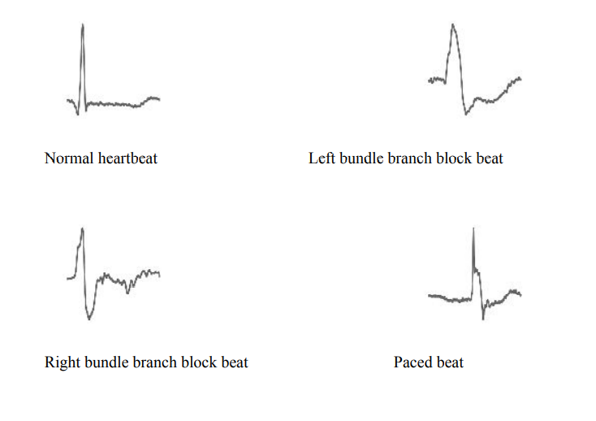

### STEP 5:
Since the data was limited, we used data augmentation to significantly increase the size and diversity of the image dataset. For data augmentation we use 9 different cropping techniques namely:
1.	Left Top Crop
2.	Center Top Crop
3.	Right Top Crop
4.	Left Center Crop
5.	Center Center Crop
6.	Right Center Crop
7.	Left Bottom Crop
8.	Center Bottom Crop
9.	Right Bottom Crop

### STEP 6:
A 2-dimensional convolution neural network has been used to classify arrhythmia into one of the 5 classes one being normal and the other 4 being various kinds of arrhythmias. We have used CNN Sequential model with ELU, BatchNormalization, MaxPooling, DropOut, and Flatten for training the model.

### STEP 7:
The dataset is partitioned into train, validation, and test sets in the proportion 8:1:1. The data is then fit the model with
Number of steps per Epoch = 1000 Number of epochs = 50
Number of validation steps = 800
Test Accuracy after fitting the model = 98%

## Model Accuracy over 50 Epochs

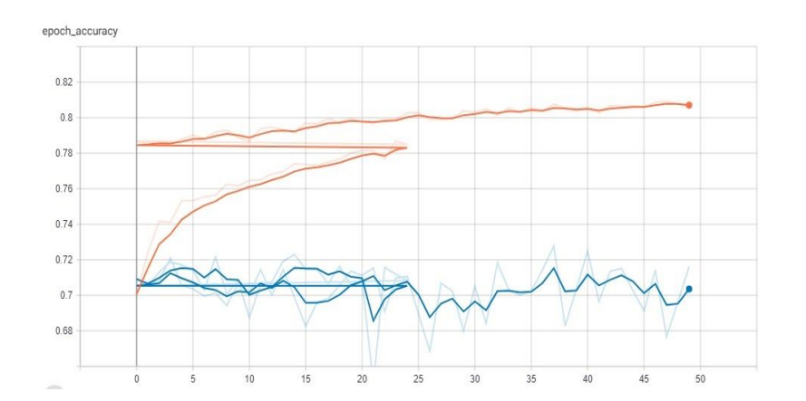

## Model loss over 50 Epochs

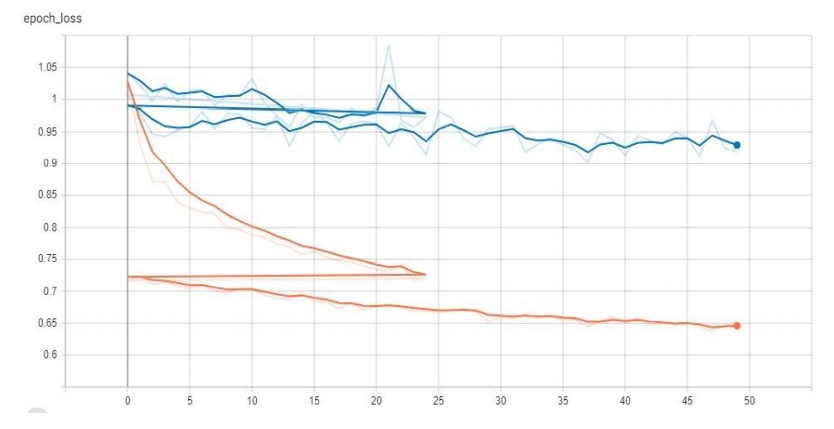

### STEP 8:
To make the whole process of classification of cardiac arrhythmia smooth and more practical, we have also developed a Django based web application. The application is very user friendly and easy to use. All the details about the classification model used in our project have been provided on the application. A user just needs to upload an image of a heartbeat and the trained model will classify the heartbeat type into its correct class. The application has been deployed on the google cloud platform and can be accessed at - http://34.70.169.199/

## 	Working of the applied model

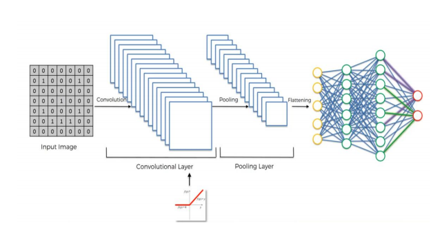

Input Image is converted to a 2d/3d array of pixels for making it easy to convolute.

## Image Conversion

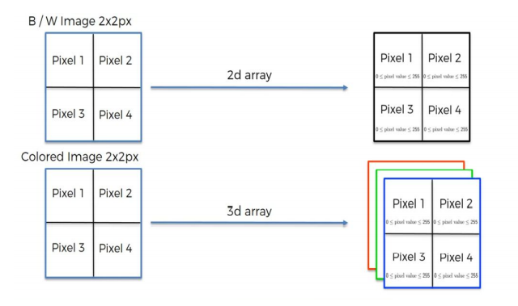

By performing the above task our image will be in binary form (either 0 or 1). Here, “1” will be representing the feature of that image and “0” will be just the non-feature part.

## Image Feature Selection

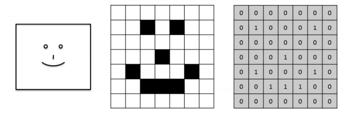

Now convolution is just the integration of two combined functions and it shows how  one function modifies the shape of others. Now, we will be deciding on a feature detector or we can say filter or kernel to reduce the size of the matrix to make our model work faster. In the above-converted image, we will apply a kernel, we have used Glorot uniform initializer so that our weights are initialized randomly.

## Applying a Feature To the Image

Now we have used Elu activation in our model since we want our model to predict non-linear function because real-life problems are always non-linear and if we don’t use Elu activation then our model will be prediction just and linear output irrespective of  our Conv dimension.

Next, we have used Max Pooling 2D, at last, this just to make all images features to be extracted easily and also to reduce the size of the feature mapping. Using this pooling will help to not care about where the heartbeat is high means if it’s in left or right it will automatically be extracted since we are using Max Pooling.

Flattening is just converting the whole 2D array to a single array or say all weights into a 1D array to make the prediction easily.

After this, we have used softmax activation since we want that all values sum to 1 so that we can also use this training model later to make a prediction for the single image as well. Since we have more than two values we have used cross-entropy to compute our loss in data.

Lastly, the model is forming full convolutional to take out all the hidden layers using steps_per_epochs and in this, our model gets to know on which factor does he have to depend to make predictions.

## Test Cases
To test how great the CNN model is, the dataset is separated into three sets specifically train, validation, and test in the proportion of 8:1:1. The model is fitted on the train set and approved on the validation set.

## Image Sets

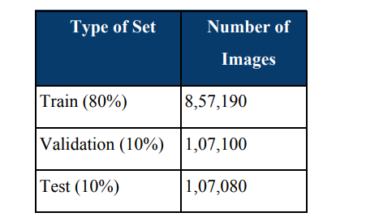

Number of steps per Epoch = 1000 Number of epochs = 50
Number of validation steps = 800
Test Accuracy after fitting the model = 98%

## 	Findings

●	The proposed model design is found efficient in classifying cardiac arrhythmia. The use of a 2-D CNN model for classification made the process more convenient and efficient. There was a large imbalance between normal and other types of beats. 
●	It is evident that deep learning proved to be better than the contemporary machine learning algorithms that we used before. 
●	The data points in the MIT-BIH database are more scattered than the dataset from the UCI machine learning repository. Both the databases were found to be highly imbalanced with respect to the number of arrhythmia and non-arrhythmia data points. 
●	Data augmentation in CNN and feature selection in contemporary algorithms proved to be highly beneficial in terms of model accuracy. 

## Classifications Accuracy

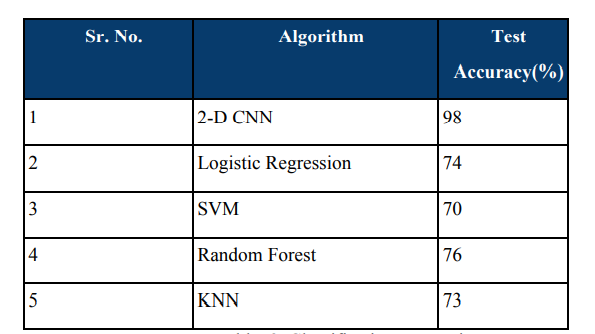

## REFERENCES

##### [1]	Soman, Thara, and Patrick O. Bobbie. "Classification of arrhythmia using machine learning techniques." WSEAS Transactions on computers 4.6 (2005): 548-552.

##### [2]	Mitra, Malay, and R. K. Samanta. "Cardiac arrhythmia classification using neural networks with selected features." Procedia Technology 10 (2013): 76-84.

##### [3]	Gupta, Vasu, Sharan Srinivasan, and Sneha S. Kudli. "Prediction and classification of cardiac arrhythmia." (2014).

##### [4]	Kelwade, J. P., and S. S. Salankar. "Radial basis function neural network for prediction of cardiac arrhythmias based on heart rate time series." 2016 IEEE First International Conference on Control, Measurement and Instrumentation (CMI). IEEE, 2016.

##### [5]	Anuradha, B., and V. C. Reddy. "CARDIAC ARRHYTHMIA CLASSIFICATION USING FUZZY CLASSIFIERS." Journal of Theoretical & Applied Information Technology 4.4 (2008).

##### [6]	Kelwade, J. P., and S. S. Salankar. "Comparative study of neural networks for prediction of cardiac arrhythmias." 2016 International Conference on Automatic Control and Dynamic Optimization Techniques (ICACDOT). IEEE, 2016.

##### [7]	Babichev, S., V. Lytvynenko, and V. Osypenko. "Implementation of the objective clustering inductive technology based on DBSCAN clustering algorithm." 2017 12th International Scientific and Technical Conference on Computer Sciences and Information Technologies (CSIT). Vol. 1. IEEE, 2017.

##### [8]	Lijun, Liang, Jin Tingting, and Huo Meiya. "Feature Identification from Imbalanced Data Sets for Diagnosis of Cardiac Arrhythmia." 2018 11th International Symposium on Computational Intelligence and Design (ISCID). Vol. 2. IEEE, 2018.
 
##### [9]	Kuo, C-C. Jay. "Understanding convolutional neural networks with a mathematical model." Journal of Visual Communication and Image Representation 41 (2016): 406-413.

##### [10]	Scherer, Dominik, Andreas Müller, and Sven Behnke. "Evaluation of pooling operations in convolutional architectures for object recognition." International conference on artificial neural networks. Springer, Berlin, Heidelberg, 2010.
